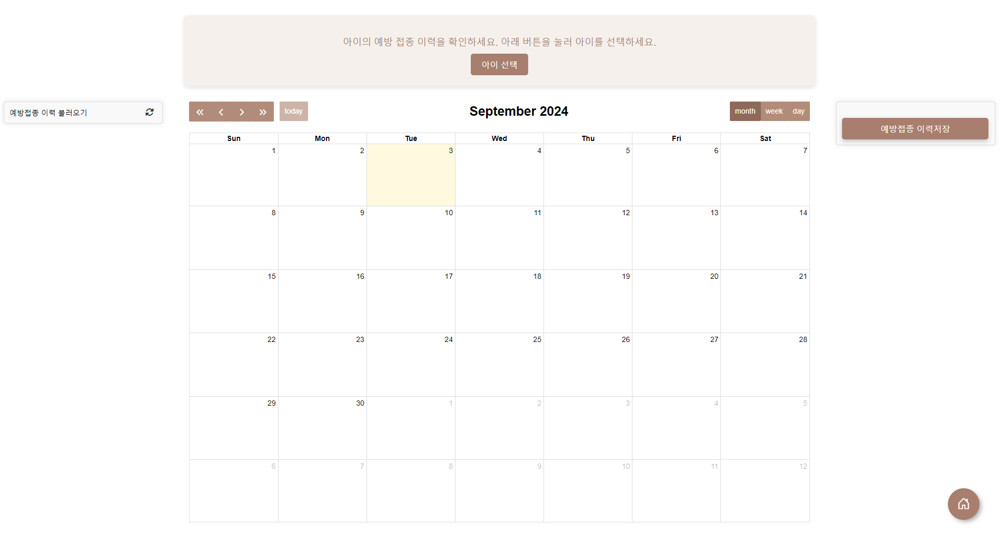
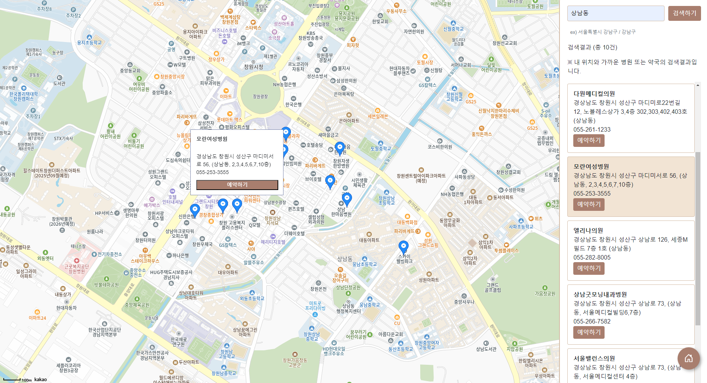
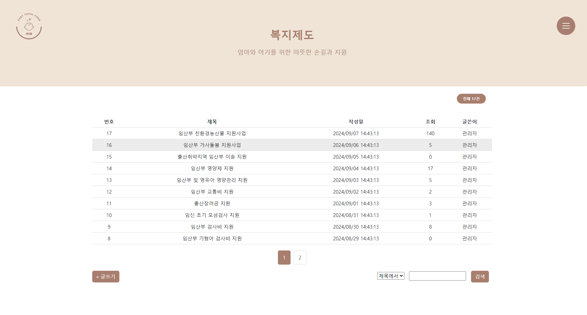
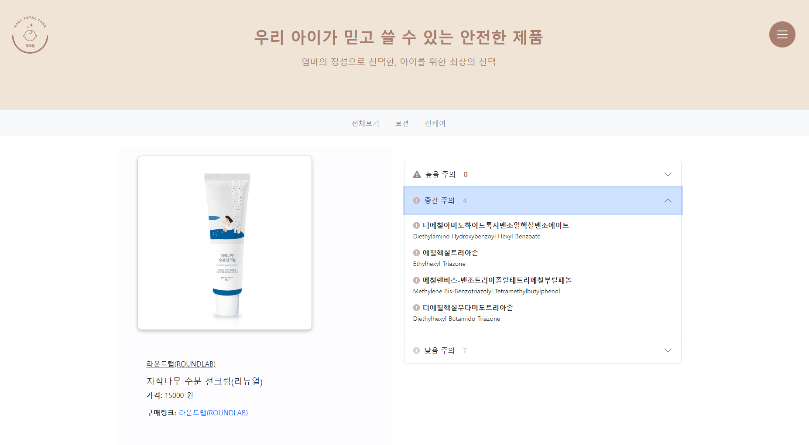

# ibom

산모와 아기를 위한 맞춤형 케어 웹 서비스

**ibom**은 임산부와 육아 초기 보호자를 위한
**맞춤형 일정 관리 및 정보 제공 웹 애플리케이션**입니다.

예방접종 일정, 병원 정보, 복지 제도, 성장 정보 등
여러 곳에 흩어져 있는 정보를 하나의 서비스로 통합하여
사용자 상황에 맞는 맞춤형 케어를 제공하는 것을 목표로 개발되었습니다.

* [프로젝트 소개 PDF](./docs/ibom_project.pdf)

---

## 프로젝트 개요

* 프로젝트명: ibom
* 개발 기간: 2024.07.30 ~ 2024.08.30
* 개발 인원: 2명
* 주요 대상: 임산부 및 육아 초기 보호자
* 목표: 예방접종 및 성장 정보를 기반으로 한 맞춤형 케어 시스템 제공

---

## 주요 기능

### 1. 예방접종 캘린더

* 아이 생년월일 및 접종 이력을 기반으로 예방접종 일정 자동 생성
* D-day 방식으로 남은 접종 일수 시각화
* FullCalendar를 활용한 월 단위 캘린더 UI 제공

### 2. 성장 정보 시각화

* 사용자 입력값(키, 몸무게 등)을 기반으로 성장 상태 시각화
* 국가 통계 데이터를 활용한 평균 성장 패턴 비교 제공

### 3. 병원 정보 및 예약

* 공공데이터 API 연동을 통한 산부인과 병원 정보 제공
* 네이버 지도 API를 활용한 병원 위치 마커 표시
* 병원 예약 기능 및 출산 가능 여부 정보 제공(일부 기능 예정)

### 4. 복지 제도 정보 제공

* 산모 및 아기를 위한 복지 제도 목록 제공
* 신청 페이지 링크 연결
* 검색 및 필터링 기능 지원

### 5. 아이 제품 정보 제공

* 아기 관련 제품 카드형 리스트 및 상세 정보 제공
* 유해 성분 정보 아코디언 UI 제공
* 사용자 리뷰 기능 구현

---

## 사용 기술 스택

| 구분         | 기술                                               |
| ---------- | ------------------------------------------------ |
| Frontend   | JSP, HTML, CSS, JavaScript, jQuery, FullCalendar |
| Backend    | Java, Spring Framework, Spring MVC               |
| Database   | MySQL                                            |
| API        | 공공데이터포털 API, 네이버 지도 API                          |
| Build Tool | Maven                                            |
| Server     | Apache Tomcat 8.5                                |

---

## 담당 역할 (박서린)

* 회원가입, 로그인, 관리자 페이지 구현
* 예방접종 캘린더 전체 설계 및 개발
* 병원 위치 지도 연동 및 예약 기능 개발
* 복지 제도 게시판 및 아이 제품 게시판 구축
* 전체 UI/UX 기획 및 메인 홈 화면 제작

---

## 참고 데이터 출처

* 질병관리청 예방접종도우미
* 국민건강영양조사 성장곡선 데이터
* 공공데이터포털 병원 정보 API
